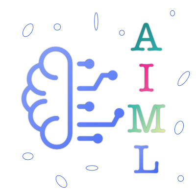

AIML Server
===========

This is the "AIML  brain" for our
[Everlife node](https://everlife.ai).

## Overview
The [Everlife node](https://everlife.ai) can use
a multitude of "brains" to communicate with the
user. This allows it to grow smarter and use
multiple technologies playing each to it's
strengths.

## Setup
There are two steps to set up your AIML brain.

1. Download the [`aiml`](https://github.com/everlifeai/aiml)
   package. This contains the python AIML server.

        $> cd ebrain-aiml/
        $> git clone https://github.com/everlifeai/aiml.git

2. Install the Node modules required by using the
   standard [`yarn`](https://yarnpkg.com) command:

        $> yarn install

## Usage
If the setup is correct, starting this server is very
simple. Just run:

        $> yarn start

## Testing
Use [`test.js`](./test.js) to chat with the
started bot. This is wrapped in a yarn
command as well:

        $> yarn chat Good Morning

## Feedback
Report Feedback, Issues, etc, to the
[Everlife.AI](https://everlife.ai) support groups.
